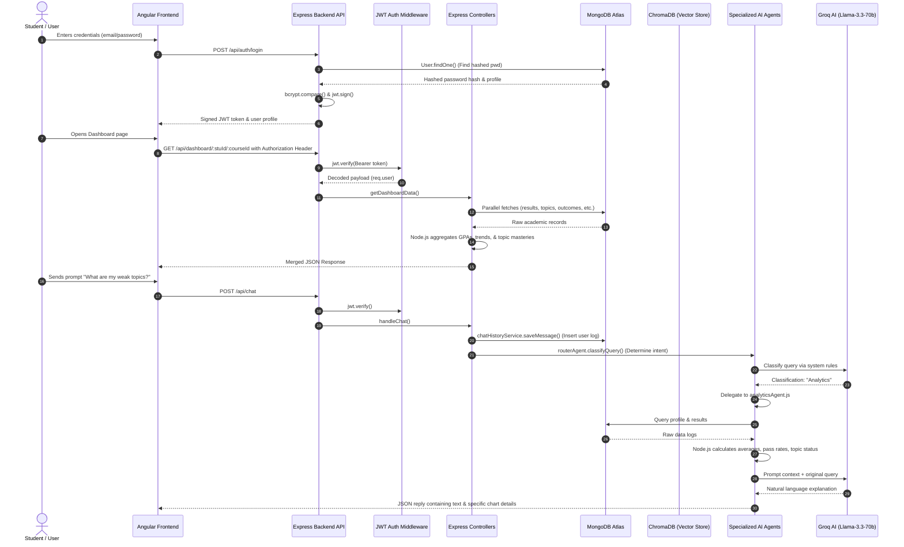

# EduAgent-V2 Live Debugging & Request Lifecycle Guide

This guide is prepared to help you walk your mentor through the entire request lifecycle of the EduAgent-V2 platform. It details the execution path from the Angular frontend to the Express backend, MongoDB database, specialized AI agents, and back.

---

## 1. Overall System Architecture Diagram

---

## 2. File Directory & Breakpoints Walkthrough

During your live demo, open the following files in VS Code and set breakpoints at the designated locations:

| Step / Flow | File to Open | Line (Approx.) | Breakpoint Identifier | Variables to Inspect |
| :--- | :--- | :--- | :--- | :--- |
| **Login Flow** | [authController.js](file:///c:/EduAgent-V2/backend/src/controllers/authController.js) | 46 | `===== BREAKPOINT 1 =====` | `req.body` (contains `email`, `password`) |
| **Login Flow** | [authController.js](file:///c:/EduAgent-V2/backend/src/controllers/authController.js) | 56 | `===== BREAKPOINT 2 =====` | `email`, `user` (MongoDB user record) |
| **Login Flow** | [authController.js](file:///c:/EduAgent-V2/backend/src/controllers/authController.js) | 70 | `===== BREAKPOINT 3 =====` | `password` (raw input), `user.password` (hashed) |
| **Login Flow** | [authController.js](file:///c:/EduAgent-V2/backend/src/controllers/authController.js) | 80 | `===== BREAKPOINT 4 =====` | `payload` (contains `student_id`, `role`, `program_id`) |
| **Login Flow** | [authController.js](file:///c:/EduAgent-V2/backend/src/controllers/authController.js) | 90 | `===== BREAKPOINT 5 =====` | `token` (signed JWT), return JSON payload |
| **JWT Flow** | [auth.js](file:///c:/EduAgent-V2/backend/src/middleware/auth.js) | 18 | `===== BREAKPOINT 6 =====` | `authHeader` (Authorization header value) |
| **JWT Flow** | [auth.js](file:///c:/EduAgent-V2/backend/src/middleware/auth.js) | 30 | `===== BREAKPOINT 7 =====` | `decoded` (parsed token fields) |
| **Dashboard** | [dashboardController.js](file:///c:/EduAgent-V2/backend/src/controllers/dashboardController.js) | 17 | `===== BREAKPOINT 8 =====` | `req.user.student_id`, `req.params.courseId` |
| **Dashboard** | [dashboardController.js](file:///c:/EduAgent-V2/backend/src/controllers/dashboardController.js) | 37 | `===== BREAKPOINT 9 =====` | `student` profile matching query |
| **Dashboard** | [dashboardController.js](file:///c:/EduAgent-V2/backend/src/controllers/dashboardController.js) | 45 | `===== BREAKPOINT 10 =====` | `course` data matching query |
| **Dashboard** | [dashboardController.js](file:///c:/EduAgent-V2/backend/src/controllers/dashboardController.js) | 53 | `===== BREAKPOINT 11 =====` | Parallel collections response array |
| **Dashboard** | [dashboardController.js](file:///c:/EduAgent-V2/backend/src/controllers/dashboardController.js) | 234 | `===== BREAKPOINT 12 =====` | Outgoing JSON response object |
| **Chatbot** | [chatController.js](file:///c:/EduAgent-V2/backend/src/controllers/chatController.js) | 11 | `===== BREAKPOINT 13 =====` | `req.body.message` (the user's prompt text) |
| **Chatbot** | [chatController.js](file:///c:/EduAgent-V2/backend/src/controllers/chatController.js) | 32 | `===== BREAKPOINT 14 =====` | Orchestrator arguments |
| **Chatbot** | [chatController.js](file:///c:/EduAgent-V2/backend/src/controllers/chatController.js) | 35 | `===== BREAKPOINT 15 =====` | Returned result (agent, reply) |
| **Multi-Agent** | [agentService.js](file:///c:/EduAgent-V2/backend/src/services/agentService.js) | 26 | `===== BREAKPOINT 16 =====` | `studentId`, `message` to be saved |
| **Multi-Agent** | [agentService.js](file:///c:/EduAgent-V2/backend/src/services/agentService.js) | 32 | `===== BREAKPOINT 17 =====` | Conversation textBlock context |
| **Multi-Agent** | [agentService.js](file:///c:/EduAgent-V2/backend/src/services/agentService.js) | 40 | `===== BREAKPOINT 18 =====` | `targetAgent` dispatching keyword |
| **Routing** | [routerAgent.js](file:///c:/EduAgent-V2/backend/src/agents/routerAgent.js) | 80 | `===== BREAKPOINT 19 =====` | Message to classify |
| **Routing** | [routerAgent.js](file:///c:/EduAgent-V2/backend/src/agents/routerAgent.js) | 85 | `===== BREAKPOINT 20 =====` | Local non-academic forbidden match result |
| **Routing** | [routerAgent.js](file:///c:/EduAgent-V2/backend/src/agents/routerAgent.js) | 109 | `===== BREAKPOINT 21 =====` | `systemPrompt` (defines agent personalities) |
| **Routing** | [routerAgent.js](file:///c:/EduAgent-V2/backend/src/agents/routerAgent.js) | 135 | `===== BREAKPOINT 22 =====` | `cleanClassification` (assigned agent category) |
| **Analytics** | [analyticsAgent.js](file:///c:/EduAgent-V2/backend/src/agents/analyticsAgent.js) | 545 | `===== BREAKPOINT 23 =====` | Classified local sub-intent |
| **Analytics** | [analyticsAgent.js](file:///c:/EduAgent-V2/backend/src/agents/analyticsAgent.js) | 551 | `===== BREAKPOINT 24 =====` | Resolved student profile |
| **Analytics** | [analyticsAgent.js](file:///c:/EduAgent-V2/backend/src/agents/analyticsAgent.js) | 579 | `===== BREAKPOINT 25 =====` | results, topics, outcomes, exam schedules |
| **Analytics** | [analyticsAgent.js](file:///c:/EduAgent-V2/backend/src/agents/analyticsAgent.js) | 769 | `===== BREAKPOINT 26 =====` | Compiled `structuredContext` text |
| **Analytics** | [analyticsAgent.js](file:///c:/EduAgent-V2/backend/src/agents/analyticsAgent.js) | 800 | `===== BREAKPOINT 27 =====` | Prompt messages payload |
| **Analytics** | [analyticsAgent.js](file:///c:/EduAgent-V2/backend/src/agents/analyticsAgent.js) | 811 | `===== BREAKPOINT 28 =====` | Final `reply` text received from Groq |
| **RAG** | [pdfUploadController.js](file:///c:/EduAgent-V2/backend/src/controllers/pdfUploadController.js) | 37 | `===== BREAKPOINT 29 =====` | Multi-part file buffer |
| **RAG** | [pdfUploadController.js](file:///c:/EduAgent-V2/backend/src/controllers/pdfUploadController.js) | 62 | `===== BREAKPOINT 30 =====` | parsed text chunks |
| **RAG** | [pdfUploadController.js](file:///c:/EduAgent-V2/backend/src/controllers/pdfUploadController.js) | 70 | `===== BREAKPOINT 31 =====` | ChromaDB vector store payload |
| **RAG** | [pdfUploadController.js](file:///c:/EduAgent-V2/backend/src/controllers/pdfUploadController.js) | 79 | `===== BREAKPOINT 32 =====` | metadata reference object saved |
| **RAG** | [ragAgent.js](file:///c:/EduAgent-V2/backend/src/agents/ragAgent.js) | 23 | `===== BREAKPOINT 33 =====` | MongoDB file exist boolean |
| **RAG** | [ragAgent.js](file:///c:/EduAgent-V2/backend/src/agents/ragAgent.js) | 29 | `===== BREAKPOINT 34 =====` | Similar chunks matching query |
| **RAG** | [ragAgent.js](file:///c:/EduAgent-V2/backend/src/agents/ragAgent.js) | 38 | `===== BREAKPOINT 35 =====` | context payload passed to intentRouter |
| **Study Plan** | [studyPlannerAgent.js](file:///c:/EduAgent-V2/backend/src/agents/studyPlannerAgent.js) | 261 | `===== BREAKPOINT 36 =====` | Initial query payload and MongoDB records |
| **Study Plan** | [studyPlannerAgent.js](file:///c:/EduAgent-V2/backend/src/agents/studyPlannerAgent.js) | 328 | `===== BREAKPOINT 37 =====` | JSON plan sections returned from Groq |
| **Study Plan** | [studyPlannerAgent.js](file:///c:/EduAgent-V2/backend/src/agents/studyPlannerAgent.js) | 335 | `===== BREAKPOINT 38 =====` | Generated PDF fileId |
| **Study Plan** | [studyPlannerAgent.js](file:///c:/EduAgent-V2/backend/src/agents/studyPlannerAgent.js) | 374 | `===== BREAKPOINT 39 =====` | Payload showing `downloadUrl` and `preview` |

---

## 3. Step-by-Step Execution Flows

### A. Login Flow (Student Login)
1. **Frontend Request**: The student enters their username and credentials in the Angular login screen. The app triggers a POST request to `/api/auth/login` containing `email` and `password`.
2. **Breakpoint 1 (authController.js:46)**: Inspect `req.body` to show the credentials payload.
3. **Breakpoint 2 (authController.js:56)**: Inspect Mongoose fetching the user record by matching the input against `email`, `student_id`, or `userId` in the `users` collection.
4. **Breakpoint 3 (authController.js:70)**: Inspect `comparePassword(password)`. Bcrypt compares the salt-hashed password in the database against the plain-text credentials input.
5. **Breakpoint 4 (authController.js:80)**: Inspect the JWT payload structure. Explain that the payload contains user credentials details (`userId`, `name`, `email`, `role`, `student_id`, `program_id`) required for Role-Based Access Control (RBAC).
6. **Breakpoint 5 (authController.js:90)**: Inspect the returned payload sent to Angular. It returns a signed JWT token string, and the user profile fields (including `role: 'student'`), which Angular uses to route the user to `/dashboard`.

### B. JWT Authorization Flow
1. **Frontend Injects Token**: When the student dashboard initializes, the Angular HTTP interceptor attaches the signed token inside the header: `Authorization: Bearer <token>`.
2. **Breakpoint 6 (auth.js:18)**: Inspect the received header string. Explain that the request is intercepted by the Express middleware to extract the token signature.
3. **Breakpoint 7 (auth.js:30)**: Inspect the decrypted payload variable `decoded` following `jwt.verify(token)`. Explain that the token is validated against the backend `JWT_SECRET`. Once validated, the decoded payload is set on `req.user` so down-stream route controllers know who is making the query.

### C. Dashboard Flow
1. **Breakpoint 8 (dashboardController.js:17)**: Inspect incoming route parameters containing `:studentId` and `:courseId`. The student ID is extracted from `req.user.student_id`.
2. **Breakpoint 9 & 10 (dashboardController.js:37/45)**: Inspect student and course retrieval queries.
3. **Breakpoint 11 (dashboardController.js:53)**: Inspect the parallel DB fetches (`Promise.all`). Explain that the controller queries all data in one round-trip:
   - **results**: internal assessment scores.
   - **topics**: syllabus details.
   - **outcomes**: course outcome mapping details.
   - **examschedules**: dates and times of exams.
   - **attendances**: date status logs.
   - **assignments**: task requirements.
   - **assignmentsubmissions**: grades and status.
4. **Node.js Aggregations**: The controller calculates average marks, GPAs, attendance rates, and topic statuses.
5. **Breakpoint 12 (dashboardController.js:234)**: Inspect the aggregated JSON response structure returned to Angular. Angular uses this single API payload to compile all visual indicators on the page.

### D. Chatbot Flow
1. **Breakpoint 13 (chatController.js:11)**: Request received from the user asking *"What are my weak topics?"*.
2. **Breakpoint 14 (chatController.js:32)**: Forward the query into the central multi-agent service wrapper `agentService.js`.
3. **Breakpoint 16 (agentService.js:26)**: The system logs the user message into the MongoDB `chat_histories` collection.
4. **Breakpoint 17 (agentService.js:32)**: The router agent is called to decide which agent should handle this request.
5. **Breakpoint 19 & 21 (routerAgent.js:80/109)**: Router classifications. If it mentions performance keywords, it is fast-routed to `Analytics`. Otherwise, the prompt instructs the Groq LLM to pick the category.
6. **Breakpoint 18 (agentService.js:40)**: The query is routed to `analyticsAgent.js`.
7. **Breakpoint 23 & 25 (analyticsAgent.js:545/579)**: The analytics agent queries MongoDB records (results, syllabus topics, outcomes, etc.) for that student.
8. **Breakpoint 26 (analyticsAgent.js:769)**: Inspect `structuredContext`. Explain that Node.js aggregates the scores and structures a text block so the LLM doesn't have to perform calculations.
9. **Breakpoint 27 & 28 (analyticsAgent.js:800/811)**: Inspect the Groq completion payload. Groq uses Llama-3.3-70b to explain the structured data context naturally and returns the message response (Breakpoint 15).

### E. RAG Flow (PDF Upload & Similarity Search)
1. **Breakpoint 29 (pdfUploadController.js:37)**: The student uploads a study material PDF via POST `/api/upload`.
2. **Breakpoint 30 (pdfUploadController.js:62)**: The file is parsed into text chunks using `documentProcessorService`.
3. **Breakpoint 31 (pdfUploadController.js:70)**: Chunks are converted into vectors using local HuggingFace embeddings (`Xenova/all-MiniLM-L6-v2`) and saved into **ChromaDB**.
4. **Breakpoint 32 (pdfUploadController.js:79)**: Reference metadata is saved to the **`studymaterials`** MongoDB collection.
5. **Similarity Search**: When the student asks *"What is Paging?"*, the Router Agent classifies the query as `RAG`.
6. **Breakpoint 33 & 34 (ragAgent.js:23/29)**: The RAG Agent checks MongoDB for documents and runs a similarity search against ChromaDB to retrieve matching text chunks.
7. **Breakpoint 35 (ragAgent.js:38)**: Retrieved chunks are injected into the LLM context, which returns a response explaining the answer based on the uploaded notes.

### F. Study Plan Flow
1. **Request**: The student types *"Generate Study Plan"*, which the Router Agent classifies as `StudyPlan`.
2. **Breakpoint 36 (studyPlannerAgent.js:261)**: The study planner queries the MongoDB collections (results, topics, assignments, exams) to determine weak topics and overdue tasks.
3. **Breakpoint 37 (studyPlannerAgent.js:328)**: These metrics are sent to Groq to generate structured JSON plans.
4. **Breakpoint 38 (studyPlannerAgent.js:335)**: The structured data is passed to `pdfGeneratorService` to build a personalized PDF.
5. **Breakpoint 39 (studyPlannerAgent.js:374)**: The agent returns a payload containing a `downloadUrl` (e.g. `/api/study-plans/download/<fileId>`) and `preview` details, allowing the user to download the generated file.

---

## 4. Key MongoDB Collections & Schema Reference

When stepping through queries, explain the target collections and schemas:

1. **`users`** (Collection: `users`): Holds profile credentials and encrypted password hashes.
2. **`students`** (Collection: `students`): Holds demographic fields (`gender`, `batch`, `program_id`).
3. **`results`** (Collection: `results`): Holds marks per exam and course (`marks`, `total_marks`, `exam_name`).
4. **`courses`** (Collection: `courses`): Maps unique course IDs to names (`course_id`, `course_name`).
5. **`topics`** (Collection: `topics`): Maps syllabus chapters to courses (`topic_name`).
6. **`attendances`** (Collection: `attendances`): Holds status records (`Present` or `Absent`).
7. **`assignments`** (Collection: `assignments`): Holds task deadlines and requirements.
8. **`assignmentsubmissions`** (Collection: `assignmentsubmissions`): Tracks if student completed assignments.
9. **`studymaterials`** (Collection: `studymaterials`): Stores vector-indexed document metadata.
10. **`chat_histories`** (Collection: `chat_histories`): Stores conversational logs.
